<h1 align="center">
  <br>
    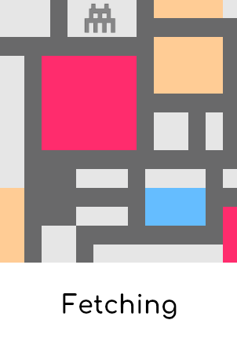
  <br>
</h1>
<p align="center"><strong>A collection of <i>fetching</i> unicode art for the terminal.</strong></p>

> You have to be in a state of play to design. If you're not in a state of play, you can't make anything.
>
> \- Paula Scher

The goal is to add a touch of beauty to your terminal, and trigger a sense of play.

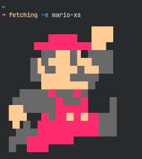

The art is **colored according to your terminal color scheme**. Here are some examples side-by-side using different themes: the top-left theme is [Dracula](https://draculatheme.com/),the top-right is [Solarized](https://ethanschoonover.com/solarized/), the other two are just me playing around with colors! The output can have a different personality depending on your color scheme.

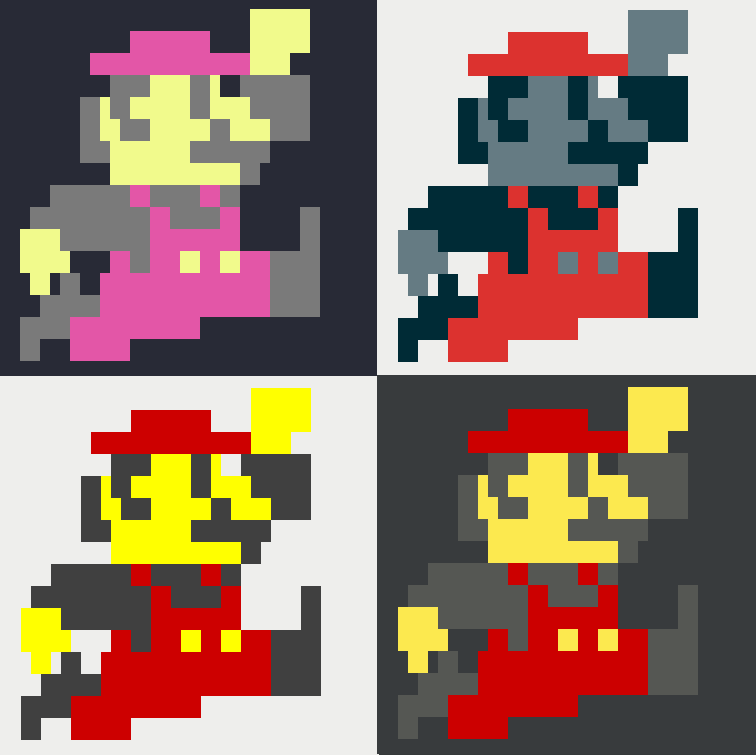

The included image scripts are **responsive to the terminal window**. This prevents distorted output in the random and slideshow modes. 🕶️

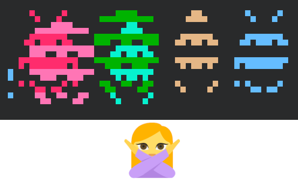

The included scripts are inspired by:

- abstract art, particularly the [De Stijl movement](https://en.wikipedia.org/wiki/De_Stijl) with its simplified forms and limited palette

  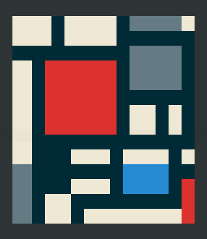
- computer games, particularly from the 1980's and 1990's

  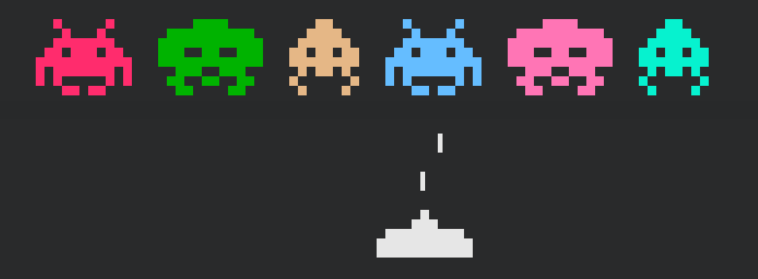
- street art

  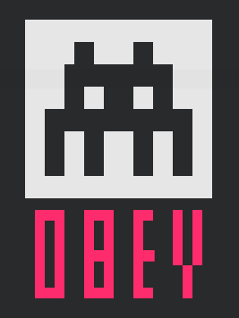

- star wars

  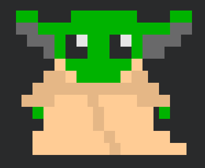

I have a list of more images I would like to add (in *todo.md*). I will work through this when the mood strikes me!

## Installation

```bash
git clone https://github.com/robole/fetching
cd fetching
bash install.sh
```

 <u>Usage</u>: `bash install.sh [OPTION]`

|  OPTIONS:           | |
|:--------------------|:-------------|
|-d, --dest           | Specify destination directory (Default: `$HOME/.local/bin`)|
|-h, --help           | Show this help|

> Note: The default installation location may not be on your [`PATH`](https://opensource.com/article/17/6/set-path-linux). You can run fetching from any folder on your system, all this script does is move the files to a "sane" executable location.

If you want to uninstall, run `bash uninstall.sh` with the same destination directory that you provided on installation.

## Usage

<u>Usage</u>: `fetching [OPTION] [SCRIPT NAME/INDEX/NUMBER OF SECONDS]`

|  OPTIONS:           | |
|:--------------------|:-------------|
| -h, --help, help|Print the help page.  |
| -l, --list, list    | List all available scripts.|
| -r, --random, random | Show a random image. It only picks image that fit within the terminal window.|
| -e, --exec, exec     | Show an image by SCRIPT NAME or INDEX. |
| -s, --slideshow, slideshow |	Run a slideshow showing a new image every NUMBER OF SECONDS. It is responsive to the terminal width.|
| -w, --width, width | Show the terminal width. It is shown as a size e.g 'xs' for extra small,and as a width in columns. This can be used to grade the size of the output of your scripts.|

The most common scenarios are:
1. The command `fetching -l` will show you all the available images to show (scripts to run). You can run an image by index: `fetching -e 4` to show the 4th image from the list, or by name `fetching -e mario-xs`.
1. I put the following command `fetching -r` in my `.bashrc` and `.zshrc` files to show a random image every time I open a new terminal.
1. If you want to run a slideshow that cycles through images every 3 seconds, you can run `fetching -s 3`.
  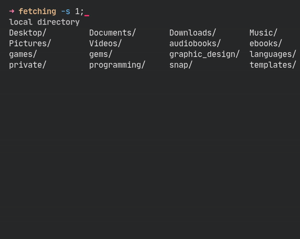

**I recommend using a monospace font**. Fonts with variable spacing may mess up the alignment of some of the art.

## Rendering differences between terminals

I noticed that some terminals show the unicode output from the script with gaps. You can see Alacritty does this (bottom left in screenshot below).

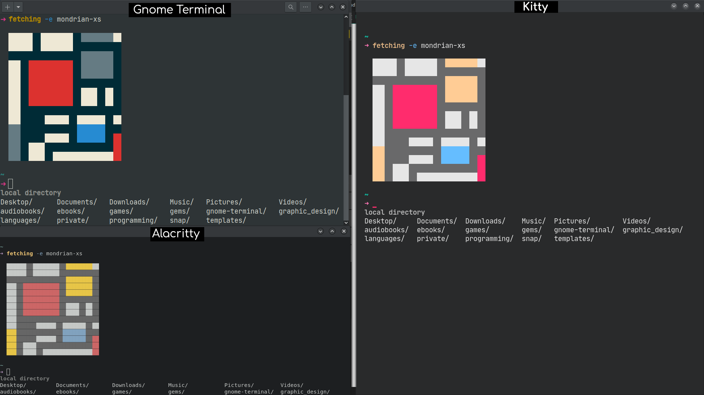

I'm not sure if there is a setting that would tweak Alacritty to look the same way as Kitty. I use Kitty, so I'm not bothered to look! I think the uniform texture is more aesthetic, but you may like the blockier style!

## Make your own art

You can use the `template` script in the root folder to get started quickly on your own creation.

There are approxmiately 143,859 unicode characters. You can use any of those, search through [the list](https://en.wikipedia.org/wiki/List_of_Unicode_characters)) to find different ones!

I mostly used the [Block Elements character set](https://en.wikipedia.org/wiki/Block_Elements) (as below) in my art, but I am interested to try out more.

```
█ ▉ ▊ ▋ ▌ ▍ ▎ ▏▐ ▕ ▇ ▆ ▅ ▄ ▃ ▂ ▁  ■ ▄ ▀  ▬ ▓ ▒ ░ 
```

I included a wider selection of symbols as a comment in `template` to get you started.

The script has the color variables to set colors for the background and foreground. You can use these together with `cat` to create your own masterpiece.

For example, this code:

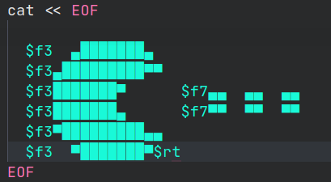

produces this output:

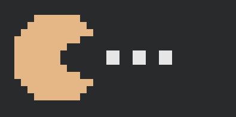

The `rt` variable is used to reset the current color to the default text color. <u>You should use always use `rt` at the end of your output text</u>, so it doesn't affect the text in your terminal after the script is run!

You will notice that all image scripts have a *naming convention*. **The size is added as a postfix to enable the responsive behaviour** e.g. `mario-xs`. To find the width of the output, run your image script and reduce the width of the terminal until the output becomes distorted. You can run the command `fetching -w`to see what the current terminal size is. Set the name of the script based on this. Ensure that the output width does not exceed the range of that size. The sizes are: xs, s, m, l, and xl. I will see if I can do something to automate this process.

If you find it difficult to create an image in this format, the process is similar to the patterns people design for cross-stitching. You could use someone else's pattern. See the [inspiration](#inspiration) section below for more on that.

### Process

You can create a reference image in one of the many pixel art editors. I like [piskel](https://www.piskelapp.com/). Its free to use, and you don't need to signup/login to use it. You can pick a grid size and play around with a composition. You don't want to do this with raw text in the script a lot of the time! 😅


Once the composition is finished, I zoom in on the composition as to have it at a decent size, and take a screenshot. I do this because I want the grid lines included, if you export it from Piskel as an image, it does not include the gridlines!

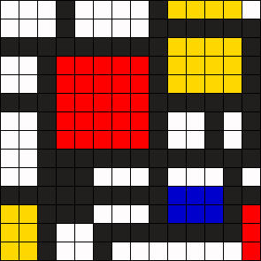

Once you are ready to transform it to text, hop into your editor, and open the `template`. I set my windows up like this and it's quite quick to do it. I run the script in the terminal in VS Code to verify what I am doing. This mondrian image took approx 30 mins of editing in VS Code, whereas the mondrian lozenge image took me half a day to get right.

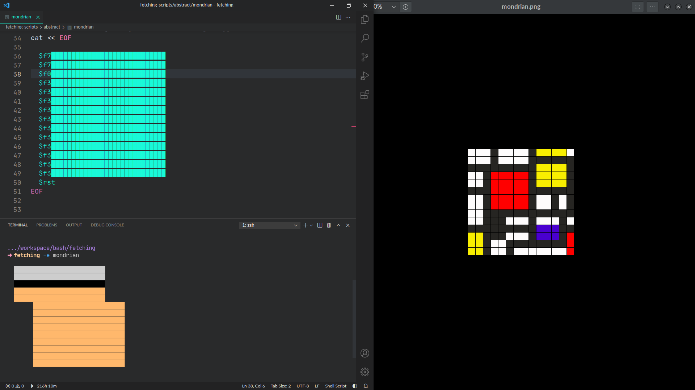

Be mindful that since you're using a "grid", you're editing text that is related in 2 dimensions! So, if you delete something from one line, it can knock your entire image out of wack. There are a few tricks I honed to minimise mistakes and become more efficient.

I will speak about specific VS Code features, but most editors should have similar features:

1. Use multipe cursors to make quick multi-line edits. Using Ctl+Shift+Down select multiple successive lines below.
  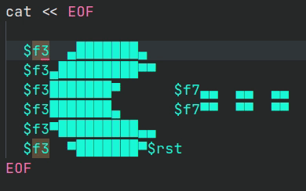
1. If you find yourself making bigger changes across multiple lines, you can switch to "column selection mode". You will find this in the menu by going `Selection` > `Column Selection Mode`. This allows you to make vertical edits. This is particularly useful for copying portions of text in the middle of lines that span across many lines.

This may sound like a lot, but you can get the hang of it quite quickly if you enjoy playing around with the process. A custom editor would be nice for this of course, but it's quite a niche thing to make!

## Inspiration

The process for creating image patterns is similar to the patterns people design when making things with beads and cross-stitching. It's digital cross-stitching really! So if you search for these patterns, you may find something you like and the design work is done for you.

Some resources I found useful are:

- [Kandi Patterns](https://kandipatterns.com/)

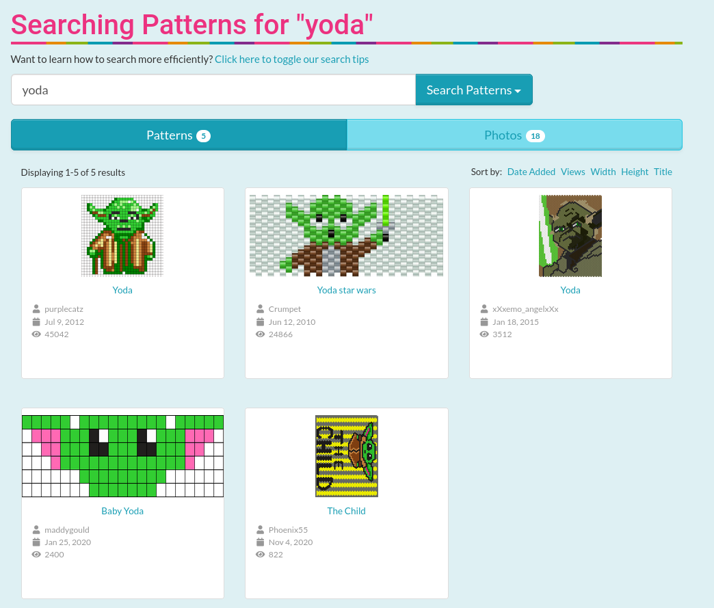

- Search [pinterest](https://www.pinterest.com/) for cross-stitch patterns, and explore some [boards](https://www.pinterest.com/flowerthread/free-cross-stitch-patterns/).

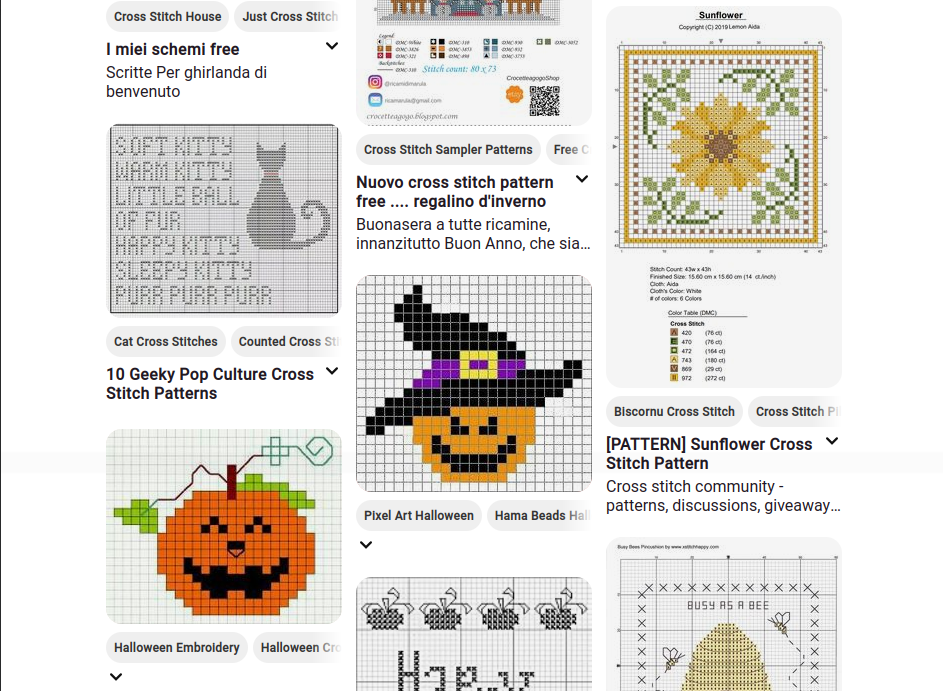

You can also look at grafitti stencils are a source of inspiration. Designs with diagonal lines and circular shapes are a bit harder to pull off.

## Contribute

If you have a suggestion, find a bug, or have made some image scripts that you would like to share, feel free to open an issue.

I am bit fussy about what image scripts I would include, so it's prob best to ask before you make a PR. I could add a "gallery" section here to point to your repo if you made some nice ones that others could include.

The minimum prerequisites for accepting an image script are that it has to have:
1. A blank line as the fist line,
1. All lines have left padding of 2 spaces
1. It resets the colors using `$rt` on the last line.

All of my image scripts are formatted consistently in this way. Generally, my images scripts are not too tall also. That's my taste.

## Show gratitude

If you are happy with this, please star the repo and recommend it to others.

You can [buy me a coffee](https://Ko-fi.com/roboleary) if you would like to enable me to make more great open-source software and tutorials. 🍵🙏

## Credit

- The original idea probably came from [this discussion on crunchbang](https://crunchbang.org/forums/viewtopic.php?id=13645).
- Derek Taylor's [Shell Color Scripts](https://gitlab.com/dwt1/shell-color-scripts) was a source of inspiration for a few scripts.
